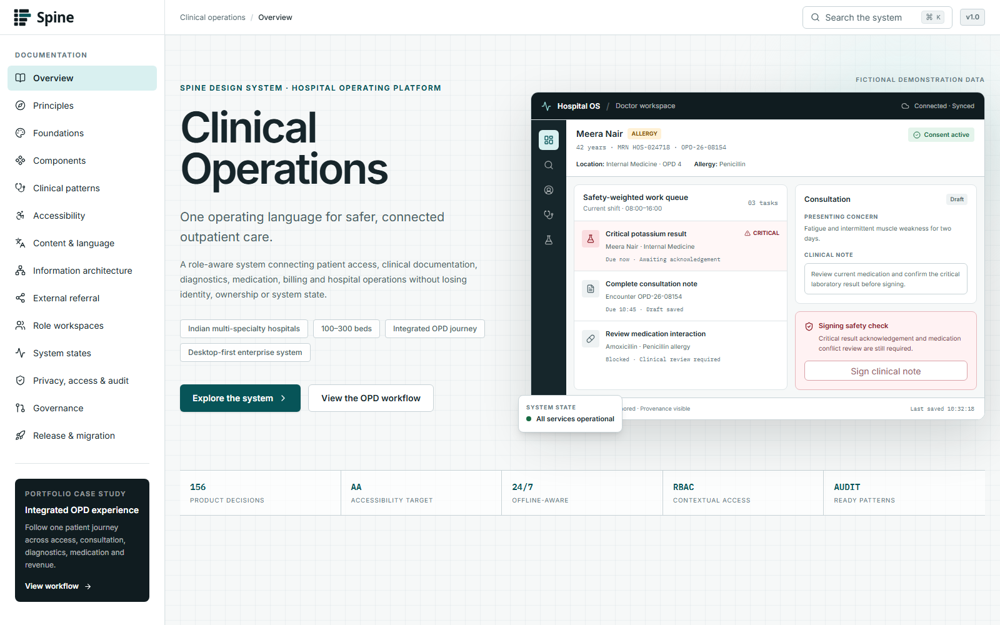
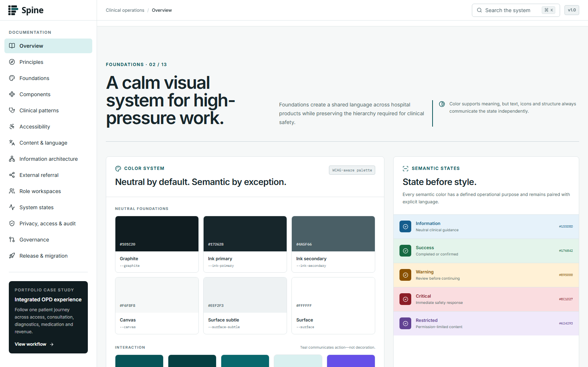
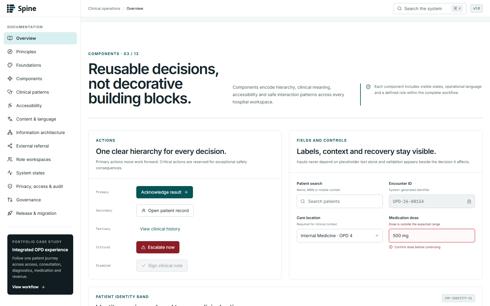
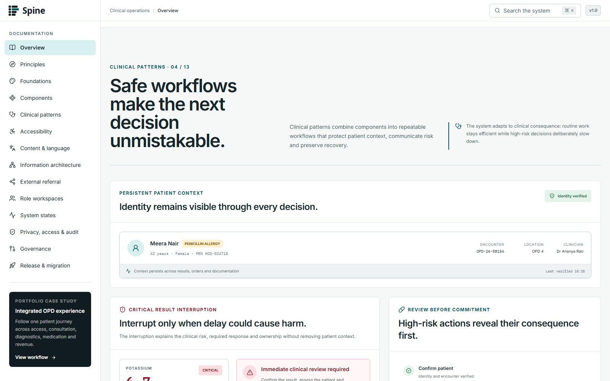
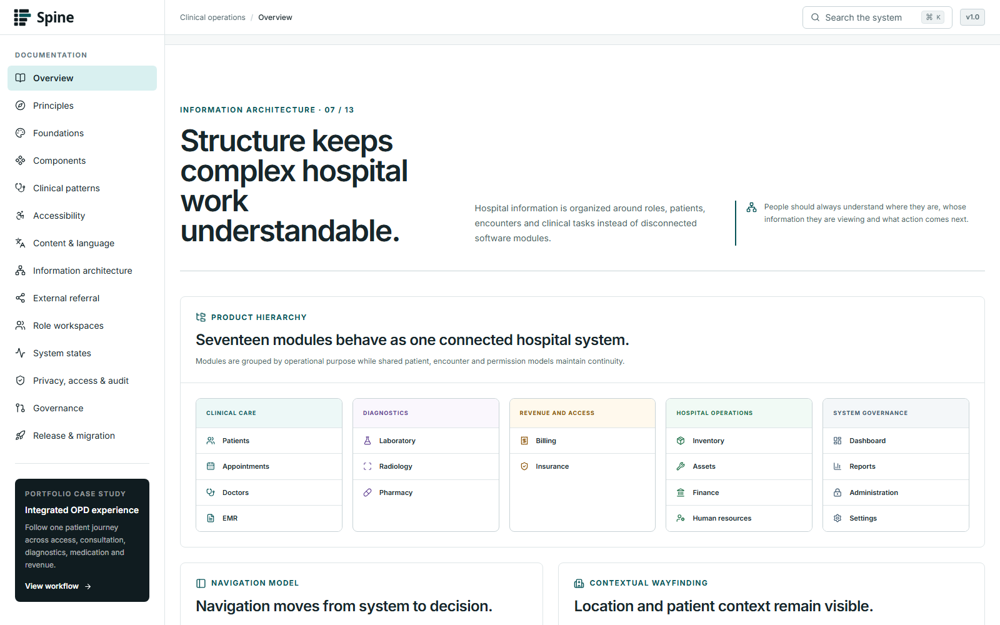
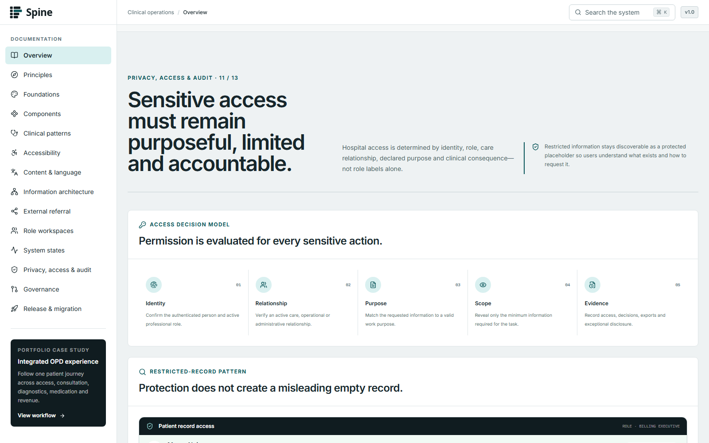

<div align="center">
  

  <h1>Spine Design System</h1>

  <p>
    An enterprise clinical-operations design system for safer,
    clearer and more connected hospital workflows.
  </p>

  <p>
    
    
    
    
    
  </p>
</div>



## Overview

Spine is the role-aware design system created for **Hospital OS**, a
conceptual clinical-operations platform connecting patient access,
consultation, diagnostics, medication, billing and hospital operations.

The project explores how a healthcare product can remain information-dense
without becoming confusing, and how safety, accessibility, privacy and
traceability can be designed into the interface from the beginning.

> Spine is a portfolio design-system case study and interface prototype.
> It is not production medical software.

## Why Spine exists

Hospital work is rarely a single-screen task. One patient journey can move
through reception, consultation, diagnostics, pharmacy and revenue teams.
Each handoff introduces the possibility of lost context, duplicate work and
unsafe assumptions.

Spine provides a shared visual and interaction language across those
workspaces while adapting information density, actions and permissions to
the user’s role.

## Core capabilities

| Capability | What it covers |
| --- | --- |
| Role-aware workspaces | Purpose-built views for reception, clinicians, diagnostics, pharmacy and operations |
| Clinical workflow patterns | Reusable patterns for patient identity, orders, results, medication and handoffs |
| Information architecture | Clear relationships between platform areas, workflows, tasks and records |
| System states | Loading, empty, partial, warning, error, offline and restricted states |
| Accessibility | Keyboard access, focus visibility, semantic structure, contrast and reduced-motion support |
| Content and language | Concise clinical language, structured labels and multilingual readiness |
| External referrals | Safe transfer of patient context beyond the hospital network |
| Privacy and audit | Permission-aware actions, reason capture, traceability and audit history |
| Governance | Contribution, review, ownership and release expectations |
| Migration planning | A practical path from shared foundations to reusable clinical workflows |

## Interface gallery

| Foundations | Components |
| :---: | :---: |
|  |  |

| Clinical patterns | Information architecture |
| :---: | :---: |
|  |  |

| Privacy, access and audit |
| :---: |
|  |

## Documentation map

The website is structured as a single navigable design-system reference.

| Section | Purpose |
| --- | --- |
| Overview | Product context, system scope and value proposition |
| Principles | Decision rules for safe and usable clinical experiences |
| Foundations | Color, typography, spacing, elevation and iconography |
| Components | Reusable interface controls and their states |
| Clinical patterns | Connected workflow patterns for Hospital OS |
| Accessibility | Inclusive interaction and implementation requirements |
| Content and language | Clinical writing, terminology and multilingual behavior |
| Information architecture | Product hierarchy and navigation relationships |
| External referral | Workflows that cross organizational boundaries |
| Role workspaces | Information and actions adapted to clinical roles |
| System states | Recovery behavior and operational feedback |
| Privacy, access and audit | Permission, consent and traceability patterns |
| Governance | Contribution, review and ownership model |
| Release and migration | Adoption sequencing and version strategy |

For the detailed design contract, read [DESIGN.md](./DESIGN.md).

## Representative workflow

The portfolio case study follows an integrated outpatient journey:

1. Patient access and identity verification
2. Appointment and consultation
3. Diagnostic ordering and result review
4. Medication and pharmacy handoff
5. Billing and revenue completion
6. Operational traceability across the entire journey

## Technical architecture

```text
src/
├── app/
│   ├── globals.css
│   ├── layout.tsx
│   └── page.tsx
├── components/
│   ├── layout/
│   │   ├── docs-sidebar.tsx
│   │   └── site-header.tsx
│   └── sections/
│       ├── foundations-section.tsx
│       ├── components-section.tsx
│       ├── clinical-patterns-section.tsx
│       └── ...
└── data/
    └── navigation.ts

public/brand/        Spine identity assets
docs/renders/        Generated interface documentation
scripts/             Documentation automation
```

## Technology

- Next.js 16 App Router
- React 19
- TypeScript
- Tailwind CSS 4
- Lucide icon system
- Inter for interface typography
- IBM Plex Mono for technical and data-oriented content
- Noto Sans Devanagari for multilingual support
- Playwright for reproducible interface renders

## Run locally

```bash
git clone https://github.com/naveenkishor305/spine-design-system.git
cd spine-design-system
npm install
npm run dev
```

Open [http://localhost:3000](http://localhost:3000).

## Regenerate documentation renders

Keep the development server running, then use:

```bash
npm run capture:renders
```

The script captures the real application at a consistent desktop viewport
and writes the results to `docs/renders`.

## Quality checks

```bash
npm run lint
npm run build
```

## Project status

The core design-system documentation, clinical patterns, navigation,
responsive structure and Spine identity are complete.

The next release step is deployment of the public portfolio experience.

## Author

Designed and developed by
[Naveen Kishor](https://github.com/naveenkishor305).
